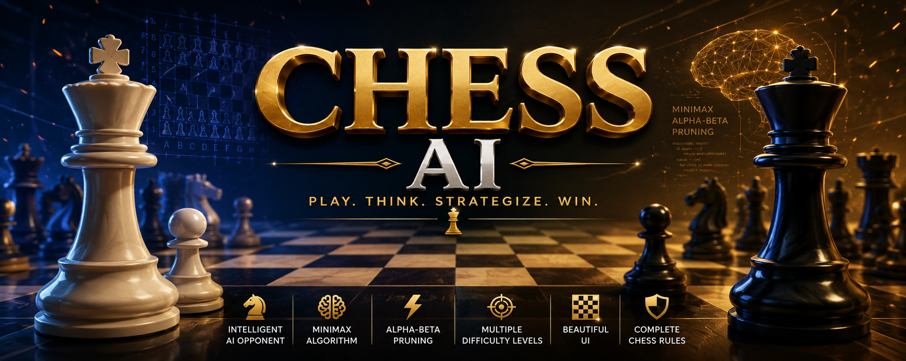
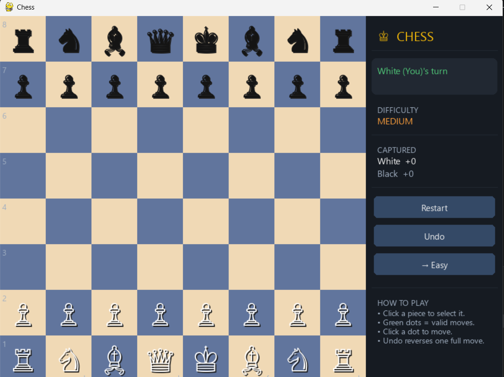
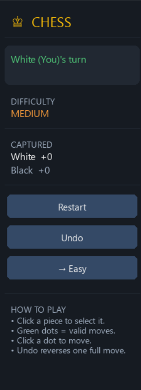

<div align="center">

# ♟️ Chess AI

### Intelligent Chess Game built with **Python** & **Pygame**

An interactive chess game featuring an AI opponent powered by the **Minimax Algorithm** with **Alpha-Beta Pruning**.

<p>
  <a href="https://github.com/alex-404-png">
    
  </a>

  <a href="https://github.com/alex-404-png/chess-ai">
    
  </a>

  <a href="https://YOUR_DEMO_URL](https://alex-404-png.itch.io/chess-ai">
    
  </a>
</p>

<p>


</p>

</div>

---

# 📸 Banner

<p align="center">
  
</p>

---

# 🎮 Gameplay Preview

<p align="center">
  
</p>

---

# 📖 About

Chess AI is a complete desktop chess game developed using **Python** and **Pygame**. The project implements all standard chess rules and includes an AI opponent capable of making strategic decisions using the **Minimax algorithm** enhanced with **Alpha-Beta Pruning**.

The interface is designed to be simple, responsive, and beginner-friendly while demonstrating classic Artificial Intelligence techniques used in board games.

---

# ✨ Features

* ♟️ Complete Chess Rules
* 🤖 AI Opponent (Minimax)
* ⚡ Alpha-Beta Pruning Optimization
* 🎯 Multiple Difficulty Levels
* 🖱️ Mouse-Based Controls
* 💡 Legal Move Highlighting
* 📍 Last Move Highlighting
* 🎨 Selected Piece Highlighting
* 👑 Check Detection
* 🏆 Checkmate Detection
* 🤝 Stalemate Detection
* 🔄 Background AI Processing
* 🖥️ Smooth Pygame Interface

---

# 🧠 AI Algorithm

The computer player searches future positions using the following pipeline:

```text
Current Position
        │
        ▼
Generate Legal Moves
        │
        ▼
Minimax Search
        │
        ▼
Alpha-Beta Pruning
        │
        ▼
Board Evaluation
        │
        ▼
Best Move Selected
```

---

# 📸 Screenshots

<p align="center">
  
  
</p>

<p align="center">
  
</p>

---

# 📂 Project Structure

```text
Chess-AI/
│
├── assets/
│   ├── banner.png
│   ├── gameplay.gif
│   ├── screenshot1.png
│   ├── screenshot2.png
│   ├── screenshot3.png
│   ├── screenshot4.png
│   └── logo.png
│
├── ai.py
├── board.py
├── constants.py
├── game.py
├── main.py
├── pieces.py
├── requirements.txt
├── LICENSE
└── README.md
```

---

# 🚀 Installation

Clone the repository

```bash
git clone https://github.com/alex-404-png/chess-ai.git
```

Go into the project folder

```bash
cd chess-ai
```

Install dependencies

```bash
pip install -r requirements.txt
```

or

```bash
pip install pygame
```

---

# ▶️ Run the Game

```bash
python main.py
```

---

# 🎮 Controls

| Action       | Control             |
| ------------ | ------------------- |
| Select Piece | Left Mouse Click    |
| Move Piece   | Left Mouse Click    |
| Restart Game | Restart Application |

---

# 🛠️ Built With

* Python
* Pygame
* Object-Oriented Programming
* Minimax Algorithm
* Alpha-Beta Pruning
* Multithreading

---

# 📈 Future Improvements

* ✅ Undo / Redo
* 📜 PGN Import & Export
* 💾 Save & Load Games
* 🌐 Online Multiplayer
* ♟️ Opening Book
* ⏱️ Chess Clock
* 🔊 Sound Effects
* ✨ Piece Animations
* 🎨 Multiple Board Themes
* 📊 AI Statistics

---

# 🤝 Contributing

Contributions are welcome!

1. Fork the repository.
2. Create your feature branch.

```bash
git checkout -b feature/new-feature
```

3. Commit your changes.

```bash
git commit -m "Add new feature"
```

4. Push to the branch.

```bash
git push origin feature/new-feature
```

5. Open a Pull Request.

---

# ⭐ Support

If you enjoyed this project, consider giving it a ⭐ on GitHub!

---

# 📄 License

This project is licensed under the **MIT License**.

---

<div align="center">

### 👨‍💻 Developed by Alex

⭐ Thanks for visiting this repository!

</div>
